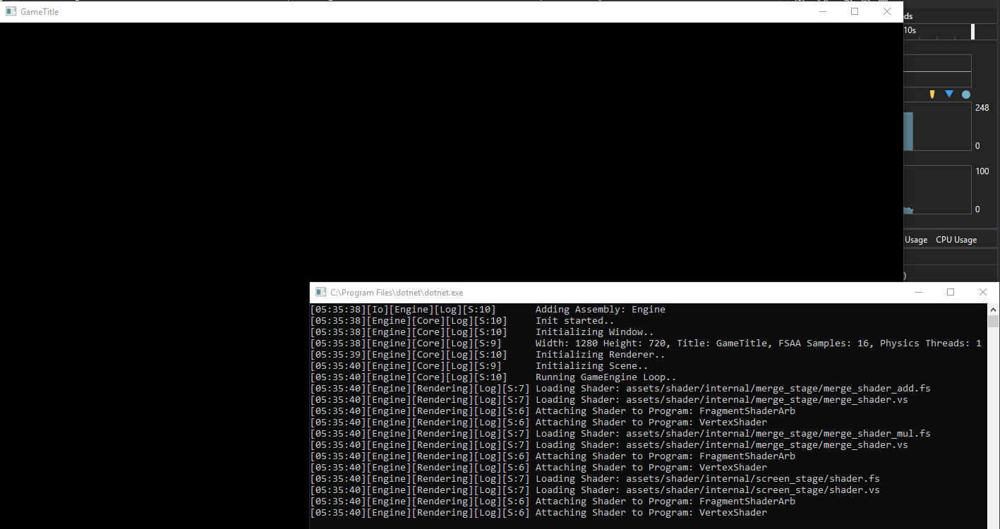
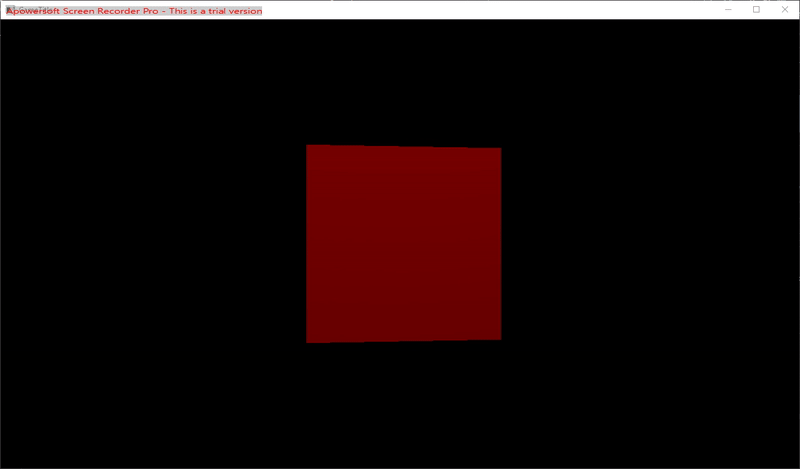

# Creating a Scene
The ExampleCode is Provided in the [GettingStarted Solution](../Tutorial/GettingStarted/Program.cs)
For setting up the engine take a look at the [Getting Started Guide](./GettingStarted.md)
## Starting the Engine
The Engine is set up with 4 lines:
```csharp
	GameEngine e = new GameEngine(EngineSettings.DefaultSettings); //Creating the Instance with Settings
    e.Initialize(); //Initializing Engine Systems(OpenAL/CL/GL/...)
    e.InitializeScene<TestScene>(); //Set a scene to load.
    //Note: The actual loading will occur during the first frame, e.g. when calling e.Run()
    e.Run(); //Runs the Engine with the Scene
```
Note: If you plan to deploy your project with the Build Tools, add these three lines in the Main function as follows:
```csharp
    GameEngine e = new GameEngine(EngineSettings.DefaultSettings); //Creating the Instance with Settings

    //------Filesystem Setup
    //Register this assembly(where the files can be embedded in)
    ManifestReader.RegisterAssembly(Assembly.GetExecutingAssembly()); 

    //Setting the Read Order(First from Assembly, then overwrite with files on disk)

    //First Read Assembly files
    ManifestReader.PrepareManifestFiles(false); 
    //Replace Any Loaded assembly files with files on the file system.
    ManifestReader.PrepareManifestFiles(true); 
    //------End Filesystem Setup

    e.Initialize(); //Initializing Engine Systems(OpenAL/CL/GL/...)
    e.InitializeScene<TestScene>(); //Set a scene to load.
    //Note: The actual loading will occur during the first frame, e.g. when calling e.Run()
    e.Run(); //Runs the Engine with the Scene
```
## Creating a Scene
A scene requires an override of the function InitializeScene(). An empty Scene Class looks like this:
```csharp
class TestScene : AbstractScene
    {
        protected override void InitializeScene()
        {
            
        }
    }
```
With this class created you can now Build and Start the Project.
The output should look something like this:



## Scene Setup
To be able to effectively render anything, we need to set up some things in the engine.

### Creating a Camera
Creating a Camera can be done with the BasicCamera Implementation included in the engine.
You need a Projection Matrix for the Camera that can be constructed by OpenTK.Matrix4 or Engine.Physics.BEPUutilities.Matrix structs.
Also you can define the position of the camera in the constructor
```csharp
Matrix4 proj = Matrix4.CreatePerspectiveFieldOfView(
	MathHelper.DegreesToRadians(75f),  //Field of View Vertical
    16f / 9f, //Aspect Ratio
    0.1f, //Near Plane
    1000f); //Far Plane

BasicCamera bc = new BasicCamera(proj, Vector3.Zero);
Add(bc); //Adding the BasicCamera(That is a gameobject under the hood) to the scene to receive events
SetCamera(bc); //Sets the Camera as the "active" camera that the scene will be rendered from.
```
### Creating the first Object
Creating Game Objects is quite straight forward.
```csharp
GameObject box = new GameObject(-Vector3.UnitZ * 4, "Box"); //Creating a new Empty GameObject
LitMeshRendererComponent lmr = new LitMeshRendererComponent( //Creating a Renderer Component
	DefaultFilepaths.DefaultLitShader, //The OpenGL Shader used(Unlit and Lit shaders are provided)
	Prefabs.Cube, //The Mesh that is going to be used by the MeshRenderer
	TextureLoader.ColorToTexture(Color.Red), //Diffuse Texture to put on the mesh
	1); //Render Mask (UI = 1 << 30)
box.AddComponent(lmr); //Attaching the Renderer to the GameObject
box.AddComponent(new RotatingComponent()); //Adding a component that rotates the Object on the Y-Axis
Add(box); //Adding the Object to the Scene.
```
#### The Rotating Component:
```csharp
public class RotatingComponent : AbstractComponent
{
    protected override void Update(float deltaTime)
    {
        Owner.Rotate(Vector3.UnitY, MathHelper.DegreesToRadians(45f)*deltaTime);
    }
}
```

The Output Should Look something Like this:



# Continue Reading
* [AI](AI.md)
* [Audio](Audio.md)
* [Deploying](Deploying.md)
* [General Info](GeneralInfo.md)
* [Getting Started](GettingStarted.md)
* [Into OpenCL](IntoOpenCL.md)
* [OpenFL](OpenFL.md)
* [OpenFL Advanced](OpenFL_Advanced.md)
* [OpenFL Instructions and Built-in Kernels](OpenFLInstructionsAndBuiltInKernels.md)
* [Physics](Physics.md)