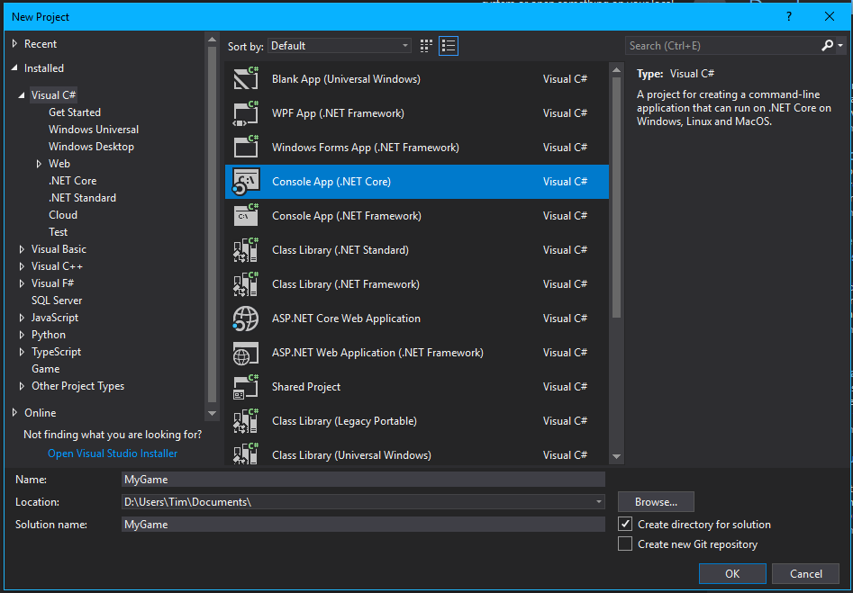

# Getting Started:
The ExampleCode is Provided in the [Getting Started Solution](../Tutorial/GettingStarted/Program.cs)
To set up a project using the Engine follow the steps below:

# Simple Setup:
Make sure that you have the .NET SDK Installed

## Open Visual Studio
For this Demonstration Visual Studio 2017 Enterprise is used.

## Create a new Project as depicted below
Console App (.NET Core)
Note: Visual Studio is not creating the .NET Core Projects correctly, make sure to check the Target Framework in the Project Properties as it sometimes targets a version that is not present on the computer.

## Getting the Code
One of the Following Methods
### Get the Source
Open Command Line(Git for Windows needed) and run:
	
	git clone --branch <BranchName> --recurse-submodules https://github.com/ByteChkR/Minor
Execute the build_project.bat in the repository. It will build all nessecary libraries.(.NET Core SDK Required)
### Get the Binaries
Download the Version you would like to use from this [website](http://213.109.162.193/apps/EngineArchives/)
Unpack this file with your zip unpacker of choice
#### Setting Up
Make sure that the following Nuget Packages are Installed:

## Adding the Reference
### As source code
You can add the engine as an existing project to the game solution, and then add the reference from the .csproj file located at ./Minor/Engine/Engine/
The following Projects are required for the Engine.dll to compile:

### As binary
Add a new reference to the file ./Minor/Engine/Engine/bin/Release/netcoreappX.X/Engine.dll

## Build the Project. The output directory looks like this:

# Continue Reading
* [AI](AI.md)
* [Audio](Audio.md)
* [Creating A Scene](CreatingAScene.md)
* [Deploying](Deploying.md)
* [General Info](GeneralInfo.md)
* [Into OpenCL](IntoOpenCL.md)
* [OpenFL](OpenFL.md)
* [OpenFL Advanced](OpenFL_Advanced.md)
* [OpenFL Instructions and Built-in Kernels](OpenFLInstructionsAndBuiltInKernels.md)
* [Physics](Physics.md)